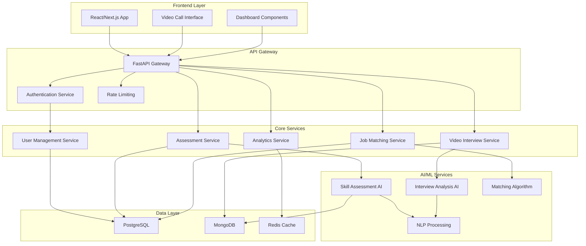

# AI-HR Platform Design Document

## Overview

The AI-HR Platform is a modern, full-stack web application built with Python backend and React frontend, leveraging cutting-edge AI/ML technologies to revolutionize recruitment. The platform uses microservices architecture for scalability, implements real-time AI assessments, and provides intelligent matching between candidates and companies.

### Technology Stack

**Backend:**
- Python 3.11+ with FastAPI framework
- PostgreSQL for primary data storage
- Redis for caching and session management
- MongoDB for storing unstructured AI analysis data
- Celery for background task processing
- WebRTC for video calling functionality

**AI/ML Stack:**
- TensorFlow/Keras for deep learning models
- OpenAI GPT API for natural language processing
- scikit-learn for traditional ML algorithms
- OpenCV for video analysis during interviews
- spaCy for text processing and analysis

**Frontend:**
- React 18 with TypeScript
- Next.js for server-side rendering and routing
- Tailwind CSS for styling and responsive design
- Framer Motion for animations and transitions
- Socket.io for real-time communications
- WebRTC for video calling interface

**Infrastructure:**
- Docker containers for deployment
- AWS/GCP for cloud hosting
- JWT for authentication
- OAuth2 for social login integration## Archite
cture

### System Architecture



### Microservices Design

The platform follows a microservices architecture with the following services:

1. **Authentication Service**: Handles user registration, login, JWT tokens, and OAuth integration
2. **User Management Service**: Manages user profiles, preferences, and account settings
3. **Assessment Service**: Conducts AI-powered tests and evaluates candidate responses
4. **Job Matching Service**: Implements ML algorithms for candidate-job matching
5. **Video Interview Service**: Manages AI video interviews and analysis
6. **Analytics Service**: Provides insights and reporting for companies and platform metrics
7. **Notification Service**: Handles email, SMS, and in-app notifications## 
Components and Interfaces

### Frontend Components

**Authentication Components:**
- `LoginForm`: Secure login with MFA support
- `RegisterForm`: Multi-step registration process
- `PasswordReset`: Secure password recovery
- `SocialLogin`: OAuth integration (Google, LinkedIn, GitHub)

**Dashboard Components:**
- `CandidateDashboard`: Personal profile, test results, job recommendations
- `CompanyDashboard`: Job postings, candidate reviews, analytics
- `AdminDashboard`: Platform management and monitoring

**Assessment Components:**
- `TestInterface`: Dynamic question rendering with timer
- `VideoInterview`: WebRTC-based AI interview interface
- `SkillAssessment`: Interactive coding challenges and problem-solving
- `ResultsDisplay`: Comprehensive test results and feedback

**Job Management Components:**
- `JobPosting`: Rich job creation form with AI assistance
- `JobSearch`: Advanced filtering and AI-powered recommendations
- `ApplicationTracker`: Real-time application status updates
- `CandidateProfile`: Detailed candidate information and assessments

### Backend API Interfaces

**Authentication Endpoints:**
```python
POST /api/auth/register
POST /api/auth/login
POST /api/auth/refresh
POST /api/auth/logout
POST /api/auth/forgot-password
```

**User Management Endpoints:**
```python
GET /api/users/profile
PUT /api/users/profile
GET /api/users/preferences
PUT /api/users/preferences
```

**Assessment Endpoints:**
```python
POST /api/assessments/start
GET /api/assessments/{id}
POST /api/assessments/{id}/submit
GET /api/assessments/results/{id}
POST /api/interviews/schedule
GET /api/interviews/{id}/join
```

**Job Management Endpoints:**
```python
POST /api/jobs/create
GET /api/jobs/search
GET /api/jobs/{id}
PUT /api/jobs/{id}
POST /api/jobs/{id}/apply
GET /api/applications/status
```## D
ata Models

### Core Data Models

**User Model:**
```python
class User:
    id: UUID
    email: str
    password_hash: str
    first_name: str
    last_name: str
    user_type: UserType  # CANDIDATE, COMPANY, ADMIN
    profile: UserProfile
    created_at: datetime
    updated_at: datetime
    is_active: bool
    is_verified: bool
```

**Candidate Profile:**
```python
class CandidateProfile:
    user_id: UUID
    resume_url: str
    skills: List[Skill]
    experience_years: int
    education: List[Education]
    certifications: List[Certification]
    preferred_locations: List[str]
    salary_expectation: SalaryRange
    availability: datetime
```

**Company Profile:**
```python
class CompanyProfile:
    user_id: UUID
    company_name: str
    industry: str
    company_size: CompanySize
    website: str
    description: str
    logo_url: str
    verified: bool
```

**Job Posting:**
```python
class JobPosting:
    id: UUID
    company_id: UUID
    title: str
    description: str
    requirements: List[Requirement]
    skills_required: List[Skill]
    experience_level: ExperienceLevel
    salary_range: SalaryRange
    location: str
    remote_allowed: bool
    posted_at: datetime
    expires_at: datetime
    status: JobStatus
```

**Assessment Model:**
```python
class Assessment:
    id: UUID
    candidate_id: UUID
    assessment_type: AssessmentType
    questions: List[Question]
    responses: List[Response]
    ai_analysis: AIAnalysis
    score: float
    completed_at: datetime
    duration_minutes: int
```

**AI Analysis Model:**
```python
class AIAnalysis:
    assessment_id: UUID
    skill_scores: Dict[str, float]
    personality_traits: Dict[str, float]
    communication_score: float
    technical_competency: float
    recommendations: List[str]
    confidence_level: float
```## AI/ML 
Implementation Design

### Skill Assessment AI

**Natural Language Processing Pipeline:**
1. **Text Preprocessing**: Clean and tokenize candidate responses
2. **Semantic Analysis**: Use spaCy and BERT models for understanding
3. **Skill Extraction**: Identify technical skills and competencies
4. **Scoring Algorithm**: Multi-dimensional scoring based on accuracy, depth, and clarity

**Machine Learning Models:**
- **Classification Model**: Categorize responses by skill level (Beginner/Intermediate/Advanced)
- **Regression Model**: Predict candidate success probability for specific roles
- **Clustering Model**: Group candidates by skill profiles for better matching

### Video Interview AI

**Computer Vision Pipeline:**
1. **Face Detection**: Real-time face tracking using OpenCV
2. **Emotion Recognition**: Analyze facial expressions for confidence and engagement
3. **Speech Analysis**: Process audio for clarity, pace, and filler words
4. **Gesture Recognition**: Evaluate body language and presentation skills

**Real-time Processing:**
- WebRTC stream processing for live analysis
- Background noise reduction and audio enhancement
- Real-time feedback generation during interviews
- Post-interview comprehensive report generation

### Job Matching Algorithm

**Collaborative Filtering:**
- Analyze successful placements to improve matching accuracy
- Consider company preferences and candidate feedback
- Implement matrix factorization for recommendation systems

**Content-Based Filtering:**
- Match job requirements with candidate skills
- Consider location preferences and salary expectations
- Factor in career progression and growth potential

**Hybrid Approach:**
- Combine collaborative and content-based methods
- Use ensemble learning for improved accuracy
- Implement A/B testing for algorithm optimization##
 Security Design

### Authentication & Authorization

**Multi-Factor Authentication:**
- SMS/Email OTP verification
- TOTP (Time-based One-Time Password) support
- Biometric authentication for mobile apps
- Social login with OAuth2 (Google, LinkedIn, GitHub)

**JWT Token Management:**
- Short-lived access tokens (15 minutes)
- Long-lived refresh tokens (7 days)
- Token rotation and blacklisting
- Secure token storage in httpOnly cookies

**Role-Based Access Control (RBAC):**
- Candidate, Company, Admin roles
- Granular permissions for different features
- Resource-level access control
- API endpoint protection

### Data Security

**Encryption:**
- AES-256 encryption for sensitive data at rest
- TLS 1.3 for data in transit
- End-to-end encryption for video calls
- Encrypted database connections

**Privacy Protection:**
- GDPR compliance for EU users
- Data anonymization for analytics
- Right to be forgotten implementation
- Consent management system

**Security Monitoring:**
- Real-time threat detection
- Automated security scanning
- Audit logging for all user actions
- Intrusion detection and prevention

## Error Handling

### Frontend Error Handling

**User Experience:**
- Graceful degradation for network issues
- Informative error messages with suggested actions
- Retry mechanisms for failed requests
- Offline mode for basic functionality

**Error Boundaries:**
- React error boundaries for component failures
- Fallback UI components for critical errors
- Error reporting to monitoring services
- User-friendly error pages

### Backend Error Handling

**API Error Responses:**
- Standardized error response format
- HTTP status codes following REST conventions
- Detailed error messages for development
- Sanitized error messages for production

**Exception Management:**
- Global exception handlers
- Custom exception classes for business logic
- Automatic error logging and alerting
- Circuit breaker pattern for external services

**Data Validation:**
- Input validation at API level
- Database constraint enforcement
- File upload security scanning
- Rate limiting and DDoS protection#
# Testing Strategy

### Frontend Testing

**Unit Testing:**
- Jest and React Testing Library for component testing
- Mock API responses for isolated testing
- Snapshot testing for UI consistency
- Coverage target: 90%+ for critical components

**Integration Testing:**
- End-to-end testing with Cypress
- User journey testing for critical flows
- Cross-browser compatibility testing
- Mobile responsiveness testing

**Performance Testing:**
- Lighthouse audits for performance metrics
- Bundle size optimization
- Lazy loading implementation
- Core Web Vitals monitoring

### Backend Testing

**Unit Testing:**
- pytest for Python backend testing
- Mock external dependencies
- Database testing with test fixtures
- Coverage target: 95%+ for business logic

**API Testing:**
- Automated API testing with pytest
- Contract testing for microservices
- Load testing with Locust
- Security testing for vulnerabilities

**AI/ML Testing:**
- Model accuracy validation
- A/B testing for algorithm improvements
- Bias detection and fairness testing
- Performance benchmarking

### Infrastructure Testing

**Deployment Testing:**
- Docker container testing
- Infrastructure as Code validation
- Database migration testing
- Rollback procedure testing

**Monitoring & Observability:**
- Application performance monitoring (APM)
- Real-time error tracking
- Business metrics dashboards
- Automated alerting systems

## Deployment Architecture

### Development Environment
- Local development with Docker Compose
- Hot reloading for rapid development
- Mock services for external dependencies
- Automated testing on code changes

### Production Environment
- Kubernetes orchestration for scalability
- Auto-scaling based on traffic patterns
- Blue-green deployment strategy
- Comprehensive monitoring and logging

### CI/CD Pipeline
- Automated testing on pull requests
- Security scanning and vulnerability assessment
- Automated deployment to staging
- Manual approval for production deployment